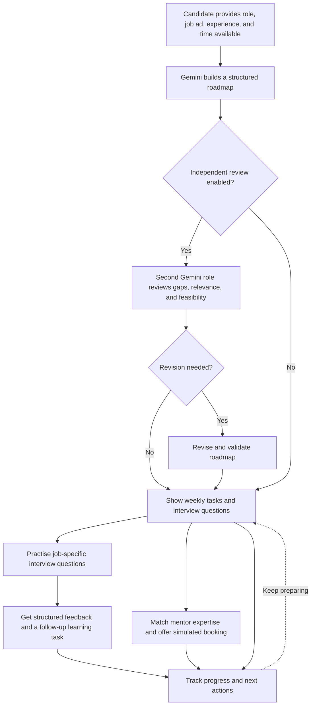

# ZEIL CareerConnect

**From job discovery to interview readiness.**

**ZEIL Hackathon 2026 · Pack 14**  
**Developed by Prabhsimran**

**[Open the live CareerConnect app](https://zeil-careerconnect-jtbhgutnaqpt9hyfdumkxb.streamlit.app/)**

ZEIL CareerConnect helps job seekers prepare for a *specific* opportunity. It converts a job advertisement and the candidate's stated experience into a practical AI-powered preparation roadmap, connects skill gaps with relevant fictional mentors, and turns interview feedback into the next learning task.

**Prepare → Connect → Practise → Receive feedback → Improve**

## Why CareerConnect?

Finding a job opportunity does not automatically tell a candidate how to prepare for it. Generic career advice may overlook the actual job requirements, the candidate's current skills, and the time available before an interview. CareerConnect brings role-specific planning, mentor discovery, simulated booking, interview coaching, and progress tracking into one workflow.

## Features

| Section | What it does |
| --- | --- |
| **My Roadmap** | Generates a personalised 1–4 week plan with strengths, priorities, measurable tasks, deliverables, estimated learning time, and technical/behavioural interview questions. |
| **Find Mentors** | Recommends fictional industry mentors based on the skills in the roadmap, with explanations of relevant matches. |
| **My Sessions** | Books or cancels simulated 30-minute mentor sessions and exports calendar events. |
| **AI Interview** | Evaluates written answers to job-specific questions and returns constructive feedback, example answers, and follow-up tasks. |
| **My Progress** | Tracks roadmap completion, learning activity, skills being prepared, interview feedback trends, and recent activity. |

### How it works



### Personalised roadmap and Two Brains

- The actual job description takes priority over the entered job title when they differ significantly.
- The plan acknowledges the candidate's *stated* experience without inventing qualifications.
- Gemini creates 2–3 measurable tasks per week, each with a skill, action, deliverable, and estimated duration.
- An **optional independent Gemini reviewer** checks the initial roadmap for overlooked requirements, irrelevant topics, unsupported claims, and unrealistic workload. If it identifies actionable issues, the app requests a revision and reviews it again.
- The original roadmap and reviewer findings can be retained or exported as evidence.
- Gemini uses structured JSON output, followed by **Pydantic validation**. Local checks enforce the selected number of weeks, repair task numbering, and attempt one repair request when model output is incomplete or invalid.

### Mentor discovery and simulated sessions

Mentor matching recognises expertise within task descriptions and related terms such as **ETL / data pipelines** and **Teamcenter / PLM**. Matching expertise is shown to explain each recommendation.

The demo provides technical mock interviews, behavioural mock interviews, and career guidance. It displays fictional two-week availability in **Pacific/Auckland** time and prices in **NZD**. SQLite prevents two workspaces from reserving the same mentor and time slot.

> **Demo only:** Mentor profiles, availability, prices, and bookings are fictional. No payment is collected, no real appointment is scheduled, and supplied portrait images do not establish any person's identity or participation.

### Interview coaching and improvement loop

Candidates answer questions linked to their saved opportunity. Gemini returns estimated practice scores from 0–10 for **accuracy, completeness, clarity, and relevance**, alongside strengths, areas to improve, an illustrative stronger answer, and a next practice task. Behavioural answers use STAR-style criteria where appropriate.

The follow-up task can be added to the roadmap. Attempts and feedback are saved for review. These scores are **coaching estimates**, not hiring decisions or predictions of employment outcomes.

### Progress dashboard

The dashboard uses saved activity rather than invented demo metrics:

- **Donut chart:** tasks completed versus remaining.
- **Weekly stacked bars:** completed and remaining tasks by week.
- **Skill preparation bars:** completed preparation work by topic, not proven skill proficiency.
- **Interview trend lines:** feedback scores across practice attempts, when available.
- **Activity timeline:** roadmap, booking, interview, and follow-up actions.

Users can export saved plans, progress, and feedback as JSON.

## Example use case

A candidate enters **Data Engineer**, but the advertisement describes a **CAD Data Migration Intern** moving engineering data from EPDM into Siemens Teamcenter. Rather than producing a generic cloud data-engineering curriculum, CareerConnect prioritises PLM, metadata mappings, assembly relationships, revision history, reconciliation, migration logs, and Python/SQL validation. It can then suggest a mentor with relevant expertise and generate targeted interview questions.

## Technical approach

**Stack:** Python, Streamlit, Google GenAI SDK (Gemini), Pydantic, SQLite, Altair, pandas, python-dotenv, Pillow, and tzdata.

| File or folder | Responsibility |
| --- | --- |
| [`app.py`](app.py) | Streamlit interface, navigation, forms, and state. |
| [`ai_service.py`](ai_service.py) | Gemini roadmap planning, independent review, revisions, interview feedback, and provider error handling. |
| [`models.py`](models.py) | Pydantic models and structured response validation. |
| [`services.py`](services.py) | SQLite persistence, mentor matching, availability, reservations, and calendar exports. |
| [`progress_ui.py`](progress_ui.py) | Progress aggregation and Altair visualisations. |
| [`mentors.json`](mentors.json) | Fictional mentor data, availability, prices, and portrait references. |
| `pic/` | Supplied portrait assets for fictional profiles. |
| `zeil_pic/` | Reference screenshots of earlier prototypes. |
| [`sample.py`](sample.py) | Synthetic fixtures for tests and evaluations. |
| `tests/` | Automated service, schema, UI, and progress tests. |
| `evaluation/` | Mentor-matching measurements and optional AI diagnostics. |

Gemini receives coaching instructions separately from JSON-encoded job/candidate inputs. Responses use structured output and are locally validated before they are displayed or saved. Inputs are checked before API requests. Authentication, quota, unavailable-model, connectivity, and timeout failures are handled without showing credentials or raw sensitive provider payloads.

## Run locally

**Requirements:** Python **3.11** (used for the Streamlit Cloud deployment), internet access for Gemini requests, and a valid Gemini API key. Run these commands from the repository root in **Windows PowerShell**:

```powershell
python -m venv .venv
.venv\Scripts\python.exe -m pip install -r requirements.txt

# Create the configuration file if it does not already exist.
if (-not (Test-Path .env)) { Copy-Item .env.example .env }

# Edit .env with your Gemini API key before starting the app.
.venv\Scripts\python.exe -m streamlit run app.py
```

Set these variables in `.env` (following [`.env.example`](.env.example)):

```dotenv
GEMINI_API_KEY=your_key_here
GEMINI_MODEL=gemini-flash-latest
```

Open **http://localhost:8501**. After changing API settings, stop the app with `Ctrl+C` and restart it. The optional `CAREERCONNECT_DB` environment variable overrides the local database path (`data/careerconnect.db`). On Streamlit Cloud, configure the Gemini key using **server-side Secrets**, not in the repository.

**Never commit `.env`, API keys, Streamlit secrets, or runtime databases.**

### Try the full workflow

1. Enter a target role, job description, experience, and preparation duration.
2. Optionally enable independent AI review, then generate a roadmap.
3. Complete one task in **My Roadmap**.
4. Explore mentor matches and reserve a **simulated** session in **My Sessions**.
5. Answer a question in **AI Interview** and add the suggested follow-up task.
6. Open **My Progress** to see your activity and next steps.

A successful new roadmap clears the input form while keeping the candidate and opportunity details accessible under the saved profile. A failed request preserves existing inputs and the previous plan. Starting a new roadmap resets its task completion, practice history, and follow-up tasks; simulated bookings and workspace activity remain saved.

## Live deployment

**App:** https://zeil-careerconnect-jtbhgutnaqpt9hyfdumkxb.streamlit.app/

The app is hosted on **Streamlit Community Cloud** using the repository's `app.py` entry point and `requirements.txt`. The Gemini key is configured as a server-side secret. The GitHub source repository remains private for hackathon review.

Use the clean app URL above for the judges. A URL containing `?workspace=...` can refer to a saved workspace and should **not** be shared as a public demo link.

**Hosting limitation:** SQLite relies on the host filesystem; saved plans and bookings may disappear after container replacement or restart if disk storage is not persistent. The deployed app is a hackathon prototype, not a production multi-user system.

## Tests and evaluation

```powershell
.venv\Scripts\python.exe -m unittest discover -s tests -v
.venv\Scripts\python.exe evaluation\score_matching.py
```

The **most recently reported local run passed 27 automated tests** covering input validation, strict response schemas, week-count constraints, schedule and numbering repair, mentor matching, booking collisions and cancellation, workspace persistence, interview context, follow-up tasks, and progress calculations. UI tests use mocked Gemini results and **do not measure live model quality**.

### Reproducible mentor-matching comparison

| Matcher | Correct outcomes on 12 curated cases |
| --- | ---: |
| Original exact-overlap baseline | **2 / 12** |
| Phrase and alias matching | **12 / 12** |

The evidence is in [`evaluation/matching_cases.json`](evaluation/matching_cases.json), [`evaluation/score_matching.py`](evaluation/score_matching.py), and [`evaluation/matching_results.json`](evaluation/matching_results.json). This is a small, fixed deterministic test set; the outcome should not be interpreted as general recommender accuracy.

### Gemini verification

Live format diagnostics validated roadmap, reviewer, and interview-feedback schemas. A separate three-week diagnostic returned weeks 1, 2, and 3 with two tasks each. The scenarios in [`evaluation/ai_cases.json`](evaluation/ai_cases.json) include different roles, timeframes, prompt injection, and weak/strong interview answers. **Full live scenario coverage has not been reported.**

An optional live evaluation uses synthetic data and may incur Gemini API charges:

```powershell
.venv\Scripts\python.exe evaluation\live_ai.py
```

If successfully run, it can generate `evaluation/live_results.json`. Do not present that report as existing or a complete AI quality benchmark unless it has actually been produced and reviewed.

## Hackathon bonus evidence

| Challenge | Implementation / evidence |
| --- | --- |
| **Built for Hiring** | Job-specific roadmap, mentor discovery, interview coaching, and task feedback loop. |
| **Two Brains** | Initial Gemini planner, independent reviewer, optional revision, and repeat review; exported review evidence can show a specific correction. |
| **Strict Shapes** | Schema-constrained Gemini output, Pydantic validation, and invalid-response tests. |
| **Prove It Works** | Twelve-case mentor-matching test, before/after outcomes, and reproducible scoring script. |
| **Ship It** | Publicly accessible Streamlit deployment URL above, subject to independent accessibility verification. |

Bonus eligibility and scoring are determined by ZEIL's judges. See [`DEMO.md`](DEMO.md) for the three-minute presentation and submission checklist.

## Limitations and future work

- Mentor identities, availability, sessions, and prices are **fictional**; there are no real calls, payments, or booking notifications.
- Interview scores and AI-generated recommendations are **practice guidance**, not verified capability assessments.
- The prototype has **no user authentication**. Anyone with a workspace-specific URL may be able to access saved workspace data. **Do not enter sensitive information or share workspace URLs.**
- Concurrent edits to a single workspace can overwrite each other. SQLite on ephemeral hosting is not reliable long-term storage.
- Future work could add authenticated accounts, real verified mentors and calendars, payments, notifications, persistent managed storage, live voice/video interview practice, and broader live AI evaluations.

## Attribution — what was and was not written by the developer

The initial Streamlit/Gemini prototype, fictional mentor data, reference screenshots, and portrait assets were supplied by the project owner. Subsequent workflow development, Gemini reviewer and interviewer logic, SQLite persistence, dashboards, automated tests, and evaluation scripts were built **with Codex assistance**. Third-party frameworks and dependencies are listed in [`requirements.txt`](requirements.txt). Portrait images are supplied demonstration assets, not photographs of confirmed mentors.

**Developed by Prabhsimran · ZEIL Hackathon 2026 · Pack 14**
