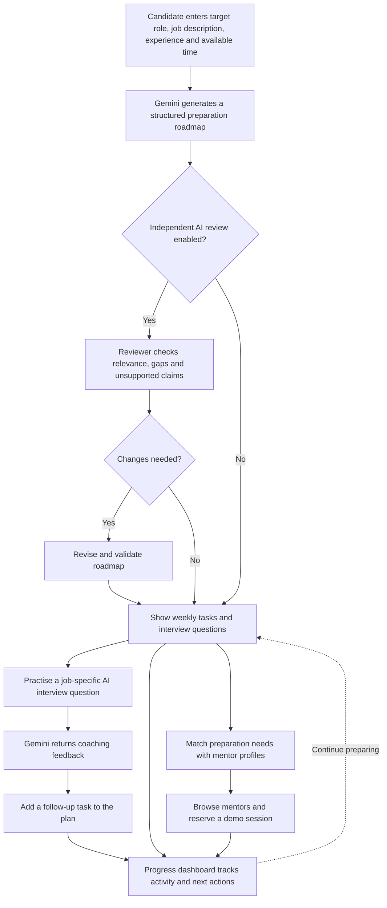

# ZEIL CareerConnect

**From a job opportunity to a practical preparation plan.**

ZEIL CareerConnect helps job seekers prepare for specific roles through personalised AI learning roadmaps, connections to industry mentors, and interview practice with actionable feedback.

Instead of giving generic career advice, the app uses the actual job advertisement and the candidate's stated experience to identify what to prepare next. Interview feedback becomes a follow-up learning task, creating a continuous preparation loop:

**Prepare → Connect → Practise → Receive feedback → Improve**

Built for the ZEIL hackathon. **Pack number: 14.**

## Features

| Section | What you can do |
| --- | --- |
| **My Roadmap** | Generate a personalised 1–4 week plan with strengths, preparation priorities, measurable tasks, deliverables, estimated learning time, and technical/behavioural interview questions. |
| **Find Mentors** | Search fictional industry mentor profiles, see relevant skill matches, view mentor portraits, and select a session. |
| **My Sessions** | Reserve a simulated 30-minute session, view confirmations, cancel bookings, and download calendar events. |
| **AI Interview** | Submit written answers to job-specific questions and receive structured practice feedback, stronger example answers, and recommended follow-up tasks. |
| **My Progress** | Track task completion, learning time, skill preparation, interview performance, and recent activity with interactive charts. |

The core feature is the **AI preparation roadmap**. Its two companion features are **mentor discovery and demo booking** and **AI interview coaching**.

### Personalised roadmap and independent review

- Detects the advertised role and explains significant differences from the entered job title.
- Recognises stated experience without inventing candidate qualifications.
- Creates 2–3 measurable tasks per week, each with an action, skill, deliverable, and estimated duration.
- Optionally uses a separate Gemini reviewer role to check job relevance, missed requirements, unsupported claims, and time realism.
- Revises the plan when the reviewer identifies concrete issues and reviews the revision again.
- Retains original plans and review findings for downloadable evidence.

The selected week count is enforced in both the Gemini JSON schema and local validation. Numbering errors are corrected without discarding tasks. Invalid or incomplete plans receive one automatic repair request before an error is shown.

### Mentor discovery and booking

Mentor matching recognises skills inside preparation sentences and normalises related terms such as data pipelines/ETL and Teamcenter/PLM. Recommendations show the matching expertise so candidates can understand why a mentor is relevant.

Session choices include technical mock interviews, behavioural mock interviews, and career guidance. Available dates are generated from fictional recurring availability over the next two weeks and displayed in **Pacific/Auckland** time. Prices use **NZD**. SQLite prevents duplicate reservations of the same mentor and time across browser workspaces.

**Mentor profiles, prices, and bookings are simulations. No payment is collected and no real call is scheduled.** Portraits come from the user-supplied `pic/` folder and do not establish the pictured people's identities or participation.

### Interview coaching and improvement

AI feedback includes accuracy, completeness, clarity, and relevance scores from 0–10, specific strengths, improvement areas, an illustrative stronger answer, and a concrete next practice task. It distinguishes incomplete answers from incorrect answers and uses STAR-style criteria for behavioural questions.

Candidates can add the recommended task to their preparation plan and track its completion. Practice history and feedback are saved. Scores are coaching estimates, not hiring decisions or employment predictions.

### Progress dashboard

| Visualisation | Meaning |
| --- | --- |
| **Donut chart** | Percentage of roadmap tasks completed. |
| **Stacked weekly bars** | Completed and remaining tasks for each week. |
| **Skill preparation bars** | Completed tasks grouped by their preparation area. |
| **Interview performance lines** | Accuracy, completeness, clarity, and relevance across practice attempts; displayed when history exists. |
| **Activity timeline** | Recent roadmap, task, interview, follow-up, and demo booking actions with timestamps. |

Charts use saved activity rather than illustrative values. Task completion percentages describe preparation activity, not proven skill proficiency. JSON downloads provide the saved plan, progress, and feedback.

## Run locally

Use Python with support for the dependencies in [requirements.txt](requirements.txt), a Gemini API key, and internet access for AI requests.

### Windows PowerShell

```powershell
python -m venv .venv
.venv\Scripts\python.exe -m pip install -r requirements.txt

# Create .env only if it does not already exist.
if (-not (Test-Path .env)) { Copy-Item .env.example .env }

# Edit .env and add your Gemini API key.
.venv\Scripts\python.exe -m streamlit run app.py
```

Open **http://localhost:8501**.

Configure `.env` using [.env.example](.env.example):

```dotenv
GEMINI_API_KEY=your_key_here
GEMINI_MODEL=gemini-flash-latest
```

`GEMINI_MODEL` is configurable to match the models available to your Google project. `CAREERCONNECT_DB` optionally overrides the default database path, `data/careerconnect.db`. Streamlit secrets can also supply the API key for hosting. Keep `.env`, secrets files, and runtime databases out of version control.

After changing API configuration, stop Streamlit with **Ctrl+C**, run the launch command again, and refresh the browser.

## Using the app

1. Enter your target title, job description, current skills/experience, and preparation duration in the sidebar.
2. Choose whether to enable independent AI review, then select **Generate my roadmap**.
3. Explore weekly tasks in **My Roadmap** and mark completed deliverables.
4. Find a relevant mentor and reserve a demo session. Review it in **My Sessions**.
5. Practise a question in **AI Interview** and add the recommended follow-up task to your plan.
6. Open **My Progress** to review your charts, practice history, and next actions.

After successful generation, the opportunity form clears. The saved profile remains available under **Saved opportunity & candidate profile**, and subsequent AI coaching uses that saved context. Failed requests retain the input fields and preserve the previous plan.

Generating a new roadmap starts fresh task completion, interview history, and follow-up tasks for that plan. Mentor bookings and the workspace activity timeline remain saved.

The sidebar is kept focused on the opportunity form. The sample-loading button, input submit hints, character counters, and extra sidebar footer notes have been removed. Synthetic sample data remains in the repository for testing and evaluation.

## Example opportunity

If the entered title is **Data Engineer** but the advertisement describes a **CAD Data Migration Intern** moving engineering data from EPDM to Siemens Teamcenter, CareerConnect prioritises the advertised PLM and CAD migration responsibilities.

Preparation can focus on metadata mappings, assembly relationships, revision history, Python/SQL validation, reconciliation, migration logs, and exception handling. A matching PLM mentor can then support a demo session, while interview practice feeds identified gaps back into the plan.

## Architecture

| File or directory | Responsibility |
| --- | --- |
| [app.py](app.py) | Streamlit interface, navigation, form state, and user interactions. |
| [ai_service.py](ai_service.py) | Gemini planning, review, answer evaluation, schedule repair, and safe error messages. |
| [models.py](models.py) | Strict Pydantic models for tasks, plans, reviews, and feedback. |
| [services.py](services.py) | SQLite persistence, skill matching, availability, bookings, and calendar exports. |
| [progress_ui.py](progress_ui.py) | Task aggregation and Altair progress charts. |
| [mentors.json](mentors.json) | Fictional mentor profiles, availability, prices, and portrait paths. |
| `pic/` | User-supplied mentor portrait assets. |
| `zeil_pic/` | Reference screenshots of the original prototype. |
| [sample.py](sample.py) | Synthetic fixtures used by tests and evaluation scripts. |
| `tests/` | Automated service, UI, schema, and progress checks. |
| `evaluation/` | Matching cases/results, AI scenarios, and optional live evaluation scripts. |

The app uses **Streamlit**, the **Google GenAI SDK**, **Pydantic**, **SQLite**, **Altair**, **pandas**, **python-dotenv**, **Pillow**, and **tzdata**.

Gemini receives a coaching system instruction and JSON-encoded untrusted source data. Responses use `response_json_schema` and are validated locally before being saved or displayed. Input validation runs before external requests. Provider failures show specific messages for access, quota, unavailable models, connectivity, and timeouts without exposing raw provider payloads or credentials.

## Persistence and access

SQLite saves plans, task completion, interview answers/feedback, follow-up tasks, activity, and demo bookings. A random workspace identifier in the page URL lets the same workspace be restored after a refresh or restart, provided the database is retained.

Keep the workspace URL private: anyone with that link can access its saved data. Account authentication and access controls are future work. Simultaneous edits to the same workspace can overwrite one another, so the prototype is intended for individual use.

## Tests and evaluation

```powershell
.venv\Scripts\python.exe -m unittest discover -s tests -v
.venv\Scripts\python.exe evaluation\score_matching.py
```

**Latest local result: 27 automated tests passed.** Coverage includes input validation, strict schema serialization, week-count constraints for all four durations, automatic schedule repair, task numbering, error handling, mentor matching, booking collisions/cancellation, workspace persistence, successful form reset, stored interview context, feedback follow-ups, and progress aggregation/chart validation.

UI tests use mocked AI responses. They verify application behaviour rather than claiming to measure live Gemini quality.

### Measured mentor-matching improvement

| Matcher | Correct outcomes on 12 fixed cases |
| --- | --- |
| Original exact-overlap baseline | **2/12** |
| Phrase and alias matching | **12/12** |

Evidence: [test inputs and expected outcomes](evaluation/matching_cases.json), [scoring script](evaluation/score_matching.py), and [measured results](evaluation/matching_results.json). These results describe a small curated deterministic matching evaluation, not general AI accuracy.

### AI verification

Live fictional format diagnostics validated roadmap, reviewer, and interview feedback schemas. A live three-week schedule diagnostic also returned weeks **1, 2, and 3**, with two tasks per week.

[AI scenarios](evaluation/ai_cases.json) document expected outcomes for different roles, timeframes, prompt injection, and weak/strong answers. Full scenario coverage has not been measured live.

The optional evaluation below sends synthetic job/profile data and practice answers to Gemini and may incur API charges:

```powershell
.venv\Scripts\python.exe evaluation\live_ai.py
```

On successful completion it writes `evaluation/live_results.json` with planning, review, revision, and weak/strong feedback evidence. That report is not currently included; the format diagnostics should not be presented as a completed end-to-end quality evaluation.

## Hackathon evidence and demo

- **Strict Shapes:** structured Gemini output with strict Pydantic validation and invalid-output tests.
- **Two Brains:** independent planner/reviewer roles, retained findings, revision, and a follow-up review. Use exported evidence to demonstrate a useful correction.
- **Prove It Works:** reproducible matching inputs, expected outcomes, a scoring script, and before/after results. Acceptance and bonus points are determined by the hackathon reviewers.

See [DEMO.md](DEMO.md) for the three-minute recording guide and submission checklist. The demo should show the connected preparation journey and clearly distinguish AI practice from simulated human mentor bookings.

## Hosting

Use `app.py` as the entrypoint and install [requirements.txt](requirements.txt). Configure the Gemini key securely on the server. SQLite needs persistent storage; temporary hosting disks may lose saved plans and bookings after restarts. A managed database is a future option for multi-user hosting. A public deployment URL is not included in this repository.

## Limitations and future work

Mentor availability is fictional, bookings are simulations, and interview feedback is coaching guidance. The prototype does not process payments, send appointment notifications, or host video calls. AI feedback and numerical scores can vary across attempts.

Future work includes authenticated accounts, verified mentors, real availability and scheduling, payments, video/voice interviews, notifications, and broader live AI evaluation.

## Attribution

The original Streamlit/Gemini prototype, mentor data, reference screenshots, and portrait images were supplied by the project owner. The completed workflow, AI reviewer/interviewer, persistence, dashboard visualisations, tests, and evaluation scripts were developed with Codex assistance. User-supplied portrait assets are used for fictional demo profiles.
# ZEIL CareerConnect

**From job discovery to interview readiness.**

ZEIL CareerConnect helps job seekers prepare for a particular role, not just a generic interview. It turns a job advertisement and the candidate’s experience into a practical learning plan, connects preparation gaps with relevant industry mentors, and uses interview feedback to suggest what to work on next.

**ZEIL Hackathon 2026 · Pack 14**

## Why CareerConnect?

Finding an opportunity is one step; knowing how to prepare for it is another. Candidates may struggle to identify the most important skills, find experienced people to practise with, and turn feedback into concrete improvements. CareerConnect brings those steps together in one workflow.

## How it works



The **AI preparation roadmap** is the core feature. Mentor discovery and demo booking, together with AI interview coaching, extend that roadmap into an ongoing preparation experience.

## Features

| Area | What it does |
| --- | --- |
| **My Roadmap** | Creates a personalised 1–4 week plan with existing strengths, preparation priorities, measurable learning tasks, estimated durations, deliverables, and technical and behavioural interview questions. |
| **Find Mentors** | Recommends fictional industry mentors based on relevant expertise and explains each match. |
| **My Sessions** | Lets candidates reserve or cancel simulated 30-minute sessions, view booking details, and download calendar events. |
| **AI Interview** | Evaluates written answers to job-specific questions and returns constructive feedback, example answers, and follow-up practice tasks. |
| **My Progress** | Visualises completed tasks, preparation activity, skill-area coverage, practice feedback trends, and recent actions. |

### Personalised plans with an optional second opinion

Gemini prioritises the responsibilities in the **actual advertisement**, even when they differ from the entered job title. It identifies skills the candidate has stated, highlights requirements not yet demonstrated, and creates two or three actionable tasks per week. Each task includes a learning objective, deliverable, and estimated time.

An optional independent Gemini reviewer checks the first plan for relevance, overlooked requirements, unsupported claims, and feasibility. When it identifies an actionable issue, the app requests a revision and checks the revised result. The original plan and review findings remain available as evidence.

Structured responses are validated with Pydantic. The app enforces the selected number of weeks, corrects task numbering without losing tasks, and attempts one repair when a response is incomplete or invalid before displaying an error.

### Mentor discovery and simulated booking

Matching looks for relevant expertise within the roadmap priorities and recognises related terminology—for example, **ETL / data pipelines** and **Teamcenter / PLM**. Candidates can see why a mentor was recommended instead of receiving an unexplained ranking.

The demo offers technical interviews, behavioural interviews, and career guidance. Fictional availability is shown over the following two weeks in **Pacific/Auckland** time, with prices in **NZD**. SQLite prevents two bookings from reserving the same mentor and slot across browser workspaces.

**All mentors, prices, and bookings are fictional. No payment is taken and no real interview is arranged.** Portraits are supplied assets used only for the demonstration; they do not imply that the pictured people are participants.

### Interview practice that leads to action

Candidates answer questions linked to their saved job and roadmap. Gemini provides practice scores for **accuracy, completeness, clarity, and relevance** (0–10), specific strengths and improvement suggestions, a stronger illustrative answer, and one next task. Behavioural answers are assessed using STAR-style criteria where appropriate.

Candidates can add the suggested task to their roadmap. Their attempts and feedback are saved so they can reflect on what has changed. These are **coaching estimates**, not hiring decisions or predictions of employability.

### Preparation progress

The dashboard reflects saved activity rather than invented scores:

- **Donut chart:** roadmap tasks completed versus remaining.
- **Weekly stacked bars:** task completion by week.
- **Skill-area bars:** completed preparation work grouped by topic, not a claim of proficiency.
- **Interview trend lines:** feedback scores across practice attempts, when available.
- **Activity timeline:** recent plans, tasks, practice, follow-ups, and demo bookings.

Users can export saved plans, progress, and feedback as JSON. The dashboard also highlights a practical next action.

## Example use case

A candidate selects **Data Engineer**, but the advertisement describes a **CAD Data Migration Intern** moving engineering data from EPDM to Siemens Teamcenter. Instead of forcing a conventional cloud data engineering syllabus, CareerConnect focuses on PLM concepts, metadata mapping, CAD assembly relationships, revision history, reconciliation, and Python/SQL validation. It then recommends relevant expertise and builds interview practice around those responsibilities.

## Architecture

| File or folder | Responsibility |
| --- | --- |
| [`app.py`](app.py) | Streamlit interface, navigation, forms, and interaction state. |
| [`ai_service.py`](ai_service.py) | Gemini roadmap planning, review, revisions, interview feedback, and safe errors. |
| [`models.py`](models.py) | Pydantic schemas for roadmaps, tasks, reviews, and feedback. |
| [`services.py`](services.py) | SQLite persistence, mentor matching, availability, reservations, and calendar exports. |
| [`progress_ui.py`](progress_ui.py) | Progress calculations and Altair visualisations. |
| [`mentors.json`](mentors.json) | Fictional mentor profiles, prices, availability, and portrait references. |
| `pic/` | Portrait assets provided for demo profiles. |
| `zeil_pic/` | Screenshots of earlier prototype iterations. |
| [`sample.py`](sample.py) | Synthetic testing fixtures. |
| `tests/` | Automated schema, service, UI, and progress tests. |
| `evaluation/` | Matching cases, scoring scripts, and AI evaluation scenarios. |

**Stack:** Python, Streamlit, Google GenAI SDK, Pydantic, SQLite, Altair, pandas, python-dotenv, Pillow, and tzdata.

Gemini receives coaching instructions separately from JSON-encoded, untrusted job and candidate inputs. Responses are checked against structured schemas and validated locally before use. The app validates inputs before API calls and presents understandable error messages for authentication, quotas, unavailable models, connection failures, and timeouts without exposing API credentials.

## Run locally

Requirements: Python compatible with [`requirements.txt`](requirements.txt), an accessible Gemini API key, and internet access for AI calls.

**Windows PowerShell** — from the project folder:

```powershell
python -m venv .venv
.venv\Scripts\python.exe -m pip install -r requirements.txt
if (-not (Test-Path .env)) { Copy-Item .env.example .env }
# Edit .env and add your Gemini API key.
.venv\Scripts\python.exe -m streamlit run app.py
```

In `.env`, use the format in [`.env.example`](.env.example):

```dotenv
GEMINI_API_KEY=your_key_here
GEMINI_MODEL=gemini-flash-latest
```

Open **http://localhost:8501**. Restart Streamlit after changing API configuration. The optional `CAREERCONNECT_DB` variable changes the default SQLite path (`data/careerconnect.db`); the API key may also be provided through Streamlit secrets when hosted. **Never commit `.env`, deployed secrets, or runtime databases.**

### Try the full workflow

1. Enter a target job, its description, your experience, and a preparation duration in the sidebar.
2. Optionally enable independent AI review, then generate a roadmap.
3. Complete a task in **My Roadmap**.
4. Explore mentor matches and create a **simulated** reservation in **My Sessions**.
5. Answer a question in **AI Interview** and add the suggested follow-up task.
6. Open **My Progress** to see updated charts, practice results, and the next action.

After a successful generation, the opportunity form clears while the saved inputs remain accessible under **Saved opportunity & candidate profile**. Interview coaching uses this saved context. A failed generation preserves the form input and the previous roadmap.

Generating a new roadmap starts a fresh set of task completions, interview attempts, and follow-up tasks. Demo bookings and the workspace activity timeline remain saved.

## Persistence and privacy

SQLite stores roadmaps, task completion, practice answers and feedback, follow-up tasks, activity events, and simulated bookings. A randomly generated workspace identifier in the page URL restores a workspace after refresh or restart **as long as the database persists**.

This prototype does not have user authentication. **Anyone with a workspace URL can access the data associated with it**, so do not enter sensitive information or share the link. Concurrent edits to the same workspace may overwrite one another.

## Testing and evaluation

Run the automated checks and mentor-matching evaluation:

```powershell
.venv\Scripts\python.exe -m unittest discover -s tests -v
.venv\Scripts\python.exe evaluation\score_matching.py
```

**Most recently reported local test result: 27 automated tests passed.** The suite covers input checks, response schemas, week-count constraints, numbering and schedule repair, mentor matching, booking collisions and cancellation, workspace persistence, interview context, follow-up tasks, and progress calculations. UI tests use mocked Gemini responses; they verify app behaviour, **not live model quality**.

### Mentor-matching evaluation

| Matcher | Correct outcomes on 12 curated test cases |
| --- | ---: |
| Original exact-overlap matcher | **2 / 12** |
| Phrase and alias matching | **12 / 12** |

Reproduce these results using [`evaluation/matching_cases.json`](evaluation/matching_cases.json), [`evaluation/score_matching.py`](evaluation/score_matching.py), and [`evaluation/matching_results.json`](evaluation/matching_results.json). The results apply to this small fixed test set; they are not a measure of general recommendation accuracy.

### Gemini verification

Live format diagnostics successfully validated roadmap, reviewer, and interview-feedback schema responses. A separate three-week planning diagnostic returned weeks **1, 2, and 3**, each containing two tasks.

[`evaluation/ai_cases.json`](evaluation/ai_cases.json) records scenarios covering different job types, time constraints, prompt injection, and stronger versus weaker practice answers. **A complete live evaluation of all scenarios has not yet been reported.** To run the optional evaluation with synthetic data:

```powershell
.venv\Scripts\python.exe evaluation\live_ai.py
```

This uses the Gemini API and may incur usage charges. On completion it can produce `evaluation/live_results.json` with planning, review, revision, and interview-feedback evidence. Do not present that report as existing unless the evaluation has actually completed.

## Hackathon evidence

- **Built for Hiring:** practical job-specific preparation, mentor discovery, and interview coaching.
- **Strict Shapes:** schema-constrained Gemini output, Pydantic validation, and tests for invalid responses.
- **Two Brains:** optional planner and independent reviewer, with retained findings and plan revision. A specific improvement must be shown to support the claim.
- **Prove It Works:** reproducible 12-case mentor-matching comparison, including expected outcomes and before/after scores. Bonus eligibility is at the judges' discretion.

See [`DEMO.md`](DEMO.md) for the video walkthrough and final submission checklist. **ZEIL Hackathon pack: 14.**

## Deployment and limitations

A Streamlit deployment uses `app.py` with [`requirements.txt`](requirements.txt) and a Gemini key stored in server-side secrets. SQLite needs persistent disk storage; ephemeral hosting may erase plans and bookings. **No public deployment URL is provided in this repository.**

This hackathon build does not process payments, verify real mentors, send booking notifications, or host video calls. AI responses and practice scores can vary. Future development would include authenticated accounts, verified mentors, real scheduling and payments, live video/voice sessions, and broader model evaluation.

## Attribution

The project owner supplied the initial Streamlit/Gemini prototype, fictional mentor data, screenshots, and portrait assets. Subsequent workflow development, reviewer/interviewer logic, persistence, dashboard visualisations, tests, and evaluation scripts were developed with **Codex assistance**. Third-party libraries are listed in `requirements.txt`; the portrait assets are used only for fictional demo profiles.

**Developed by Prabhsimran · ZEIL Hackathon 2026**
